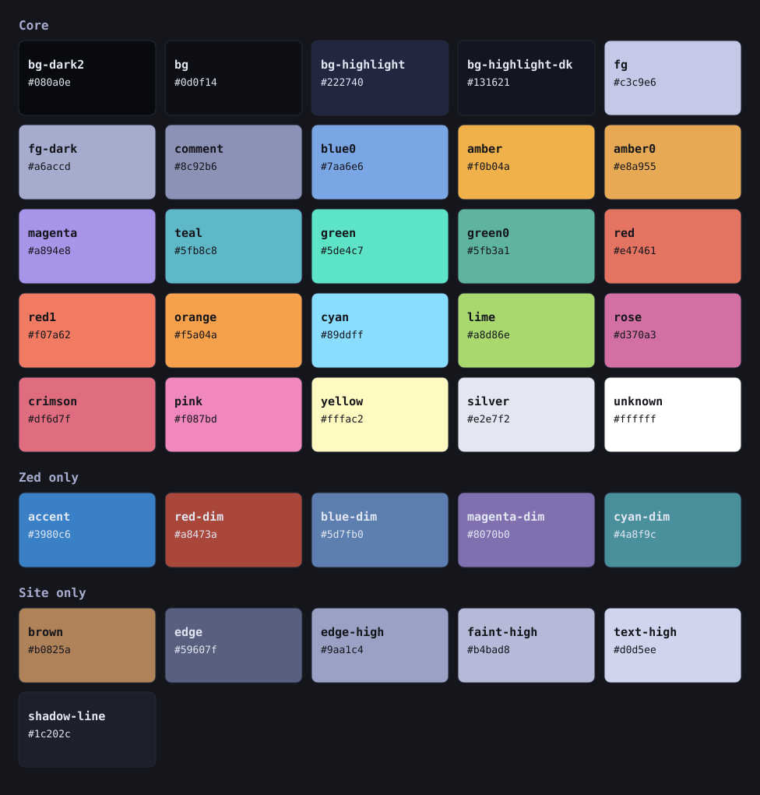

# Tenebrous

Tenebrous was initially inspired by [Poimandres](https://github.com/drcmda/poimandres-theme) and has grown into something more unique. Tenebrous is a dark color scheme. The background is a near-black blue and the text is a soft grey-purple. Amber is the main accent, used for links and headings. Blues, purples and greens cover the rest, with red and pink used sparingly. (But it is very pretty!)



## Themes

- [Tenebrous Obsidian](https://github.com/sigrunixia/Tenebrous-Obsidian), the theme for Obsidian
- [Tenebrous Zed](https://github.com/sigrunixia/Tenebrous-Zed), the theme for Zed

## Colors


Each row says where a color shows up, and the color name is its key in `palette.json`. The contrast of each is measured against Background (`#14161b`) with the WCAG formula. AA needs 4.5 to 1 for normal text and AAA needs 7 to 1.

Every text color passes AA on Background except Faint text (`comment`), which is 3.92 to 1. It passes for large text and interface parts, but not for normal body text, and it is only used for things that are meant to recede, so I considered it acceptable.

I did not require AAA, because that much contrast is not something I need yet, and designing for it leads to many sites looking the same.

### Backgrounds

The contrast here is Text (`#a6accd`) sitting on each surface.

| Where it shows up | Color | Hex | Text contrast | WCAG |
|---|---|---|---|---|
| Background, the editor and the page | bg | `#14161b` | 8.10 | AAA |
| Sidebars, tabs and the title bar | bg-dark2 | `#0d0e10` | 8.65 | AAA |
| Code blocks and the active line | bg-highlight-dk | `#1d202b` | 7.27 | AAA |
| Borders, hover and selected rows | bg-highlight | `#242838` | 6.55 | AA |

### Text

| Where it shows up | Color | Hex | Contrast | WCAG |
|---|---|---|---|---|
| Text | fg | `#a6accd` | 8.10 | AAA |
| Muted text, punctuation and code comments | fg-dark | `#898fb3` | 5.73 | AA |
| Faint text, placeholders and line numbers | comment | `#6d7397` | 3.92 | Large text and UI only |
| Bright text | silver | `#e2e7f2` | 14.60 | AAA |
| Nav item hover | unknown | `#ffffff` | 18.10 | AAA |

### Headings and links

| Where it shows up | Color | Hex | Contrast | WCAG |
|---|---|---|---|---|
| Header 1 | blue0 | `#7aa6e6` | 7.26 | AAA |
| Header 2 | amber | `#f0b04a` | 9.49 | AAA |
| Header 3 | teal | `#5fb8c8` | 7.91 | AAA |
| Header 4 | magenta | `#a894e8` | 6.95 | AA |
| Header 5 | green | `#5de4c7` | 11.54 | AAA |
| Header 6 | silver | `#e2e7f2` | 14.60 | AAA |
| Bold | blue0 | `#7aa6e6` | 7.26 | AAA |
| Italic | amber | `#f0b04a` | 9.49 | AAA |
| Links | amber0 | `#e8a955` | 8.82 | AAA |
| Link hover | amber | `#f0b04a` | 9.49 | AAA |

### Code

| Where it shows up | Color | Hex | Contrast | WCAG |
|---|---|---|---|---|
| Keyword | magenta | `#a894e8` | 6.95 | AA |
| Function | amber | `#f0b04a` | 9.49 | AAA |
| String | green | `#5de4c7` | 11.54 | AAA |
| Secondary string and escapes | green0 | `#5fb3a1` | 7.28 | AAA |
| Number | pink | `#f087bd` | 7.67 | AAA |
| Property and attribute | cyan | `#89ddff` | 11.94 | AAA |
| Operator and parameter | teal | `#5fb8c8` | 7.91 | AAA |
| Type and built-in | blue0 | `#7aa6e6` | 7.26 | AAA |
| Tag, boolean and constant | red | `#e0604a` | 5.12 | AA |
| Value | yellow | `#fffac2` | 16.98 | AAA |
| URL | amber0 | `#e8a955` | 8.82 | AAA |

### Callouts and status

| Where it shows up | Color | Hex | Contrast | WCAG |
|---|---|---|---|---|
| Note | blue0 | `#7aa6e6` | 7.26 | AAA |
| Summary | cyan | `#89ddff` | 11.94 | AAA |
| Info | teal | `#5fb8c8` | 7.91 | AAA |
| Todo | silver | `#e2e7f2` | 14.60 | AAA |
| Tip | green | `#5de4c7` | 11.54 | AAA |
| Important | pink | `#f087bd` | 7.67 | AAA |
| Success | lime | `#a8d86e` | 10.96 | AAA |
| Question | yellow | `#fffac2` | 16.98 | AAA |
| Warning | orange | `#f5a04a` | 8.63 | AAA |
| Error | red | `#e0604a` | 5.12 | AA |
| Deleted lines and error messages | red1 | `#f07a62` | 6.61 | AA |
| Fail | crimson | `#dc6074` | 5.14 | AA |
| Bug | rose | `#d0679d` | 5.26 | AA |
| Example | magenta | `#a894e8` | 6.95 | AA |

### Zed only

Zed needs an accent for the cursor and focus border, and dimmer shades for the terminal. These are interface and terminal colors, so the contrast is against Background.

| Where it shows up | Color | Hex | Contrast | WCAG |
|---|---|---|---|---|
| Cursor and focus border | accent | `#3980c6` | 4.38 | Large text and UI only |
| Terminal dim red | red-dim | `#a8473a` | 3.13 | Large text and UI only |
| Terminal dim blue | blue-dim | `#5d7fb0` | 4.42 | Large text and UI only |
| Terminal dim magenta | magenta-dim | `#8070b0` | 4.19 | Large text and UI only |
| Terminal dim cyan | cyan-dim | `#4a8f9c` | 4.91 | AA |

## Building

Every color lives in `palette.json`. Run `build.sh` and it writes the Obsidian palette file, the Zed theme and `palette.svg` from it, so a color only ever gets changed in one place.

```
./build.sh --obsidian-theme        # theme.css and snippets
./build.sh --obsidian-publish-css  # publish.css
./build.sh --obsidian-publish-js   # publish.js
./build.sh --obsidian-push         # push publish.css and/or publish.js live
./build.sh --zed                   # Zed theme
./build.sh --all                   # everything except the push
./build.sh --build-only            # build without deploying
```

Flags stack, so `./build.sh --obsidian-publish-css --obsidian-push` builds publish.css and pushes just that.

Copy `.env.example` to `.env` and point it at your repos and vault. The script reads it every run. Change the Zed template, not the Zed theme it spits out, because the next build writes over it.

## Special thanks

- [Poimandres](https://github.com/drcmda/poimandres-theme) by drcmda, the original theme that inspired this
- [Poimandres for Obsidian](https://github.com/yoGhastly/poimandres-obsidian) by yoGhastly, where the Obsidian theme started
- [Dbarenholz](https://github.com/dbarenholz) for dealing with me on [halcyon-obsidian](https://github.com/dbarenholz/halcyon-obsidian)

## Disclaimer

Anthropic's Claude did help write the build scripts.
